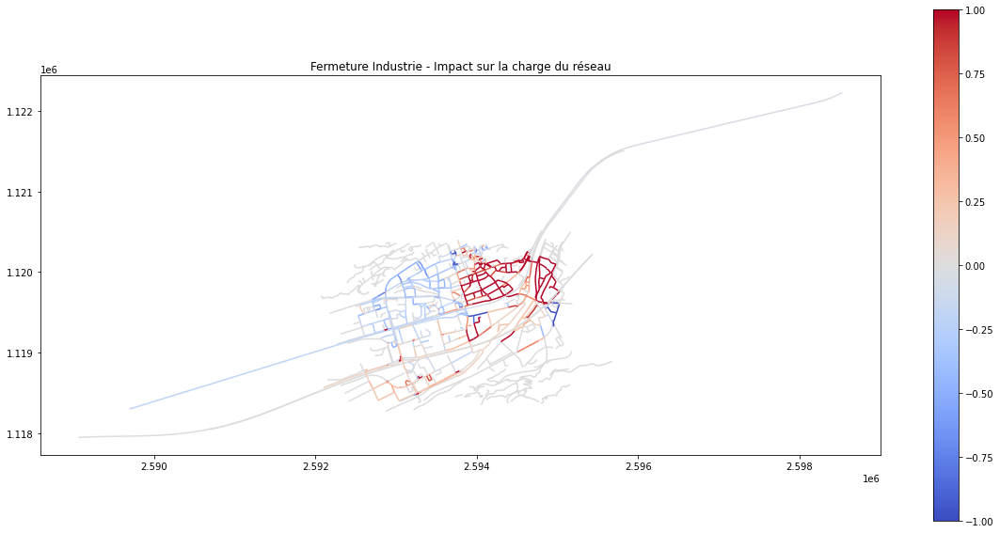
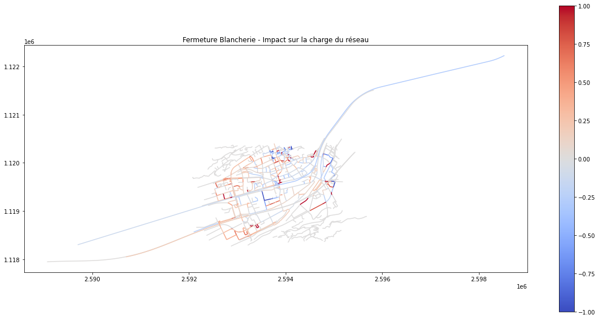

# Data API - Simulation du trafic routier – Quartier de Ronquoz

## Description

Ce projet a pour objectif de centraliser et de rendre accessibles des fichiers JSON contenant des informations sur la charge
de trafic dans le quartier de Ronquoz, à Sion. Ces données sont le résultat de simulations effectuées dans le cadre du démonstrateur pour un jumeau numérique cantonal.

## Fonctionnalités
- Accès aux données de simulation en monde CDN.
- Explorer les métadonnées et la structure des fichiers via OpenAPI.

# Exemples de visualisations

  

